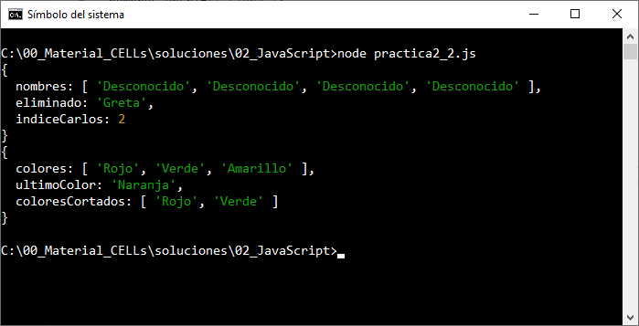
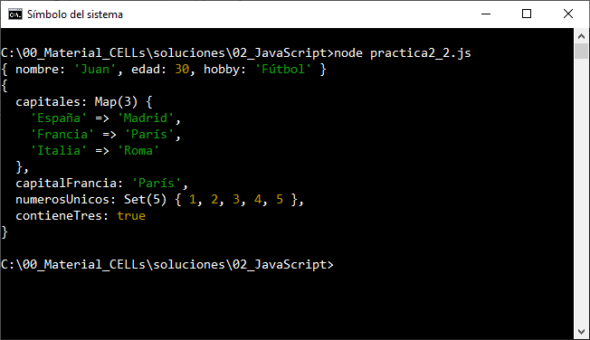
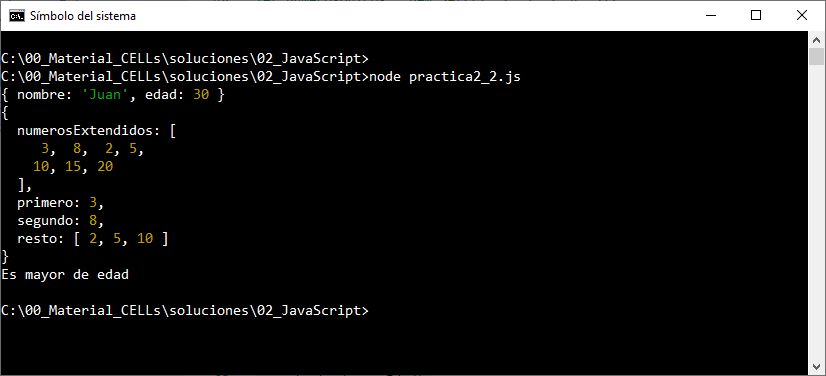

# Práctica 2.2 Manejo Avanzado de Datos en JavaScript

## Objetivo de la práctica:
Al finalizar la práctica, serás capaz de:
- Aplicar métodos avanzados de manipulación de datos y operadores en JavaScript, incluyendo el uso de estructuras como Object, Map, Set, y operadores avanzados como destructuración, spread/rest, y ternarios, para escribir código eficiente y expresivo.


## Duración aproximada:
- 35 minutos.

## Instrucciones 

### Tarea 1. Métodos de Arrays

#### **Paso 1: Usar `shift`, `unshift`, `indexOf` y `fill`**

1. Crea un array llamado `nombres` con los valores `["Greta", "Luis", "Carlos", "Everardo"]`.
2. Elimina el primer elemento del array utilizando `shift` y guarda el resultado en una variable.
3. Agrega el nombre `"Eduardo"` al inicio del array usando `unshift`.
4. Encuentra el índice del nombre `"Carlos"` usando `indexOf`.
5. Rellena todos los elementos del array con `"Desconocido"` usando `fill`.

```javascript
let nombres = ["Greta", "Luis", "Carlos", "Everardo"];
let eliminado = nombres.shift();
nombres.unshift("Elena");
let indiceCarlos = nombres.indexOf("Carlos");
nombres.fill("Desconocido");
console.log({ nombres, eliminado, indiceCarlos });
```

#### **Paso 2: Usar `push`, `pop`, `slice` y `splice`**
1. Crea un array llamado `colores` con los valores `["Rojo", "Verde", "Azul", "Amarillo"]`.
2. Agrega el color `"Naranja"` al final del array utilizando `push`.
3. Elimina el último color del array con `pop` y guárdalo en una variable.
4. Crea un nuevo array llamado `coloresCortados` que contenga solo los primeros dos colores utilizando `slice`.
5. Remueve el tercer elemento del array original usando `splice`.

```javascript
let colores = ["Rojo", "Verde", "Azul", "Amarillo"];
colores.push("Naranja");
let ultimoColor = colores.pop();
let coloresCortados = colores.slice(0, 2);
colores.splice(2, 1);
console.log({ colores, ultimoColor, coloresCortados });
```

<br/> <br/>

### **Tarea 2: Métodos Funcionales de Arrays**

#### **Paso 1: Usar `map`, `filter`, `reduce` y `sort`**

1. Crea un array llamado `numeros` con los valores `[3, 8, 2, 5, 10]`.
2. Usa `map` para crear un nuevo array donde cada número esté multiplicado por 2.
3. Filtra los números mayores a 5 utilizando `filter`.
4. Usa `reduce` para obtener la suma de todos los números.
5. Ordena el array original de forma descendente utilizando `sort`.

```javascript
let numeros = [3, 8, 2, 5, 10];
let numerosDuplicados = numeros.map(num => num * 2);
let numerosMayoresCinco = numeros.filter(num => num > 5);
let sumaTotal = numeros.reduce((acc, num) => acc + num, 0);
numeros.sort((a, b) => b - a);
console.log({ numeros, numerosDuplicados, numerosMayoresCinco, sumaTotal });
```

<br/> <br/>

### **Tarea 3: Estructuras Avanzadas: `Object`, `Map` y `Set`**

#### **Paso 1: Uso de `Object`**
1. Crea un objeto llamado `persona` con las propiedades `nombre`, `edad`, y `profesion`.
2. Agrega una nueva propiedad llamada `hobby`.
3. Elimina la propiedad `profesion`.

```javascript
let persona = { nombre: "Juan", edad: 30, profesion: "Ingeniero" };
persona.hobby = "Fútbol";
delete persona.profesion;
console.log(persona);
```

#### **Paso 2: Uso de `Map` y `Set`**
1. Crea un `Map` llamado `capitales` con los pares: `("España", "Madrid")`, `("Francia", "París")`.
2. Agrega un nuevo par al mapa: `("Italia", "Roma")`.
3. Obtén el valor de la clave `"Francia"`.
4. Crea un `Set` llamado `numerosUnicos` y agrega los valores `[1, 2, 3, 3, 4, 5]`.
5. Verifica si el valor `3` está en el conjunto.

```javascript
let capitales = new Map([["España", "Madrid"], ["Francia", "París"]]);
capitales.set("Italia", "Roma");
let capitalFrancia = capitales.get("Francia");

let numerosUnicos = new Set([1, 2, 3, 3, 4, 5]);
let contieneTres = numerosUnicos.has(3);
console.log({ capitales, capitalFrancia, numerosUnicos, contieneTres });
```

<br/> <br/>

#### **Tarea 4: Operadores Avanzados**

##### **Paso 1: Destructuración**
1. Desestructura el objeto `persona` para obtener las propiedades `nombre` y `edad`.

```javascript
let persona = { nombre: "Juan", edad: 30, profesion: "Ingeniero" };
let { nombre, edad } = persona;
console.log({ nombre, edad });
```

##### **Paso 2: Spread y Rest**
1. Usa el operador spread para copiar el array `numeros` y agregar los valores `[15, 20]`.
2. Usa el operador rest para obtener los primeros dos valores de `numeros` en variables separadas y el resto en un nuevo array.

```javascript
let numeros = [3, 8, 2, 5, 10];
let numerosExtendidos = [...numeros, 15, 20];
let [primero, segundo, ...resto] = numeros;
console.log({ numerosExtendidos, primero, segundo, resto });
```

##### **Paso 3: Operador Ternario**
1. Usa un operador ternario para verificar si la propiedad `edad` de `persona` es mayor o igual a 18 y asigna el resultado a una variable `mayorEdad`.

```javascript
let mayorEdad = edad >= 18 ? "Es mayor de edad" : "Es menor de edad";
console.log(mayorEdad);
```

<br/> <br/>

## **Resultado Esperado**
 
Captura de pantalla que muestra la salida de la Tarea 1.



<br/>

Captura de pantalla que muestra la salida de la Tarea 2.


<br/>

Captura de pantalla que muestra la salida de la Tarea 3.



<br/>

Captura de pantalla que muestra la salida de la Tarea 4.



<br/>
