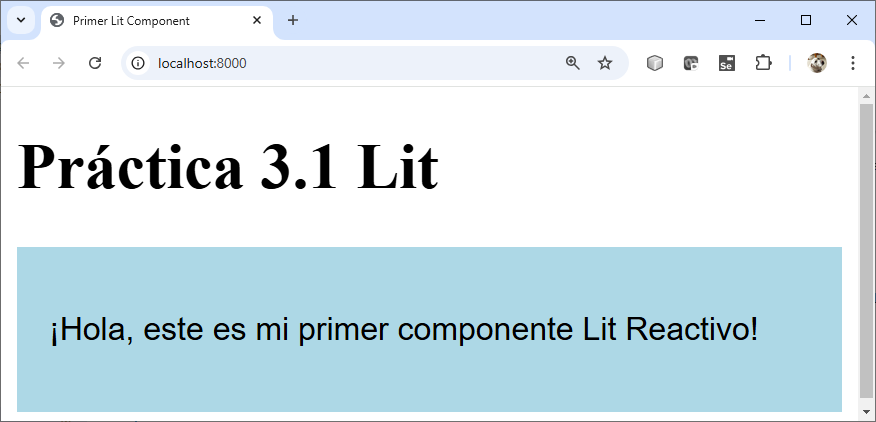
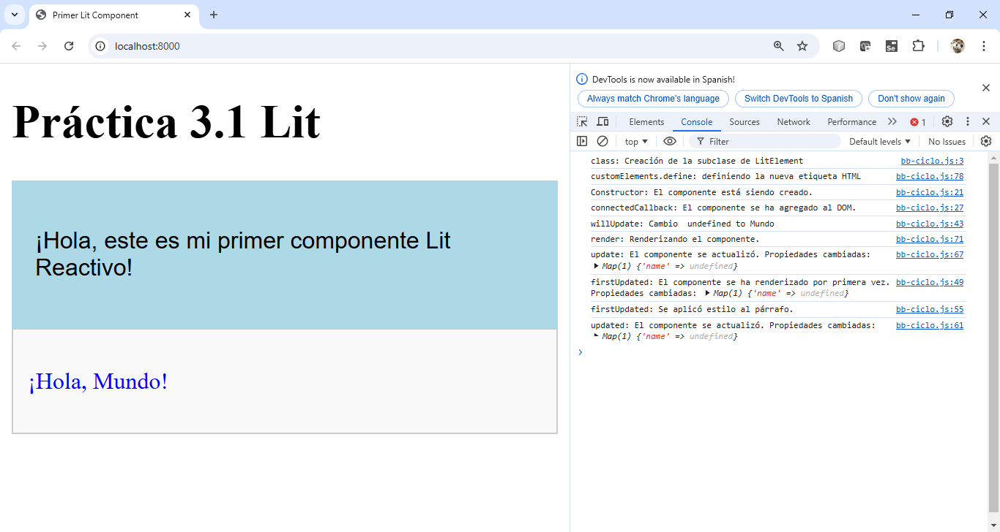
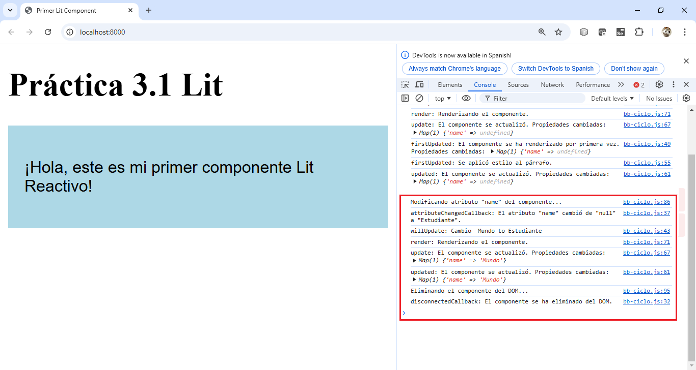
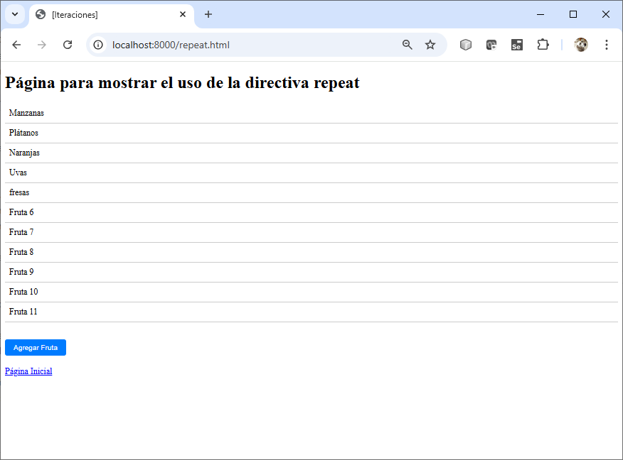

# Práctica 3.1 Lit

## Objetivo de la práctica:
Al finalizar la práctica, serás capaz de:
- Crear un componente básico utilizando Lit y renderizarlo en una página web.
- Entender el ciclo de vida de un componente Lit.
- Usar diferentes formas de gestionar condicionales.
- Utilizar diferentes formas de iteración en Lit para renderizar elementos dinámicamente en el DOM.
- Implementar la directiva repeat en un componente Lit para optimizar el renderizado de listas de elementos dinámicos.


## Duración aproximada:
- 80 minutos.

## Tabla de ayuda:

| Software | Link de Descarga | Versión |
|--------------|--------------|--------------|
|  Node.js | https://nodejs.org/en/download | v22.12.0  |
|  npm |  npm install -g npm  | 10.2.5  |
|  Lit | npm install lit  | 3.2.1  |
|  VSC | https://code.visualstudio.com/download  | v1.96.2  |
|  es-dev-server| npm install --save-dev es-dev-server   | 2.1.0 |


<br/>

## Instrucciones 

### Tarea 1: Creación de tu primer Lit Component

#### Paso 1. **Configurar el entorno de trabajo:**
   - Instalar Node.js si no está previamente instalado.
   - Crear una carpeta para el proyecto y acceder a ella mediante la terminal CMD
   - Ejecutar `npm init -y` para inicializar un proyecto con un archivo `package.json`.

#### Paso 2. **Instalar dependencias necesarias:**
   - Instalar Lit ejecutando `npm install lit`.

#### Paso 3. **Crear el archivo de componente:**
   - Crear una carpeta llamada `src` en el proyecto.
   - Crear un archivo `my-component.js` dentro de la carpeta `src`.

#### Paso 4. **Definir el componente Lit:**
   - Importar Lit en el archivo `my-component.js` escribiendo:
     ```javascript
     import { LitElement, html, css } from 'lit';
     ```
   - Extender la clase `LitElement` para definir tu componente:
     ```javascript
     class MyComponent extends LitElement {
       static styles = css`
         :host {
           display: block;
           padding: 16px;
           background-color: lightblue;
           font-family: Arial, sans-serif;
         }
       `;
     
       render() {
         return html`<p>¡Hola, este es mi primer componente Lit!</p>`;
       }
     }
     ```

- Definir un nuevo elemento personalizado para el navegador basado en la clase `MyComponent`

     ```javascript
     customElements.define('my-component', MyComponent);
     ```
    
    

#### Paso 5. **Crear el archivo HTML principal:**
   - Crear un archivo llamado `index.html` en la raíz del proyecto.
   - Agregar la estructura básica del HTML e incluir el componente:
     ```html
     <!DOCTYPE html>
     <html lang="en">
     <head>
       <meta charset="UTF-8" />
       <meta name="viewport" content="width=device-width, initial-scale=1.0" />
       <title>Primer Lit Component</title>
     </head>
     <body>
       <my-component></my-component>
       <script type="module" src="./src/my-component.js"></script>
     </body>
     </html>
     ```

#### Paso 6. **Iniciar un servidor de desarrollo:**
   - Instalar el servidor de desarrollo `lite-server` ejecutando: `npm install es-dev-server --save-dev`.
   - Agregar un script en el `package.json` para iniciar el servidor:
     ```json
     "scripts": {
        "start": "es-dev-server --app-index index.html --node-resolve --open"
     }
     ```
   - Ejecutar el comando `npm start` para iniciar el servidor y abrir el proyecto en el navegador.

#### Paso 7. **Verificar la salida:**
   - Confirmar que el componente `my-component` se renderiza correctamente con el texto y los estilos aplicados.

#### Paso 8. **Personalizar el componente:**
   - Modificar el contenido del método `render` o los estilos para explorar cómo se reflejan los cambios en la página.
   - Agrega un título a la página: `Práctica 3.1 Lit`


<br/><br/>

### **Resultado esperado:** 

- Un componente básico de Lit que muestra un mensaje en pantalla y se renderiza correctamente en un navegador.

  

- Un componente básico de Lit con los cambios en el renderizado y en la página que lo contiene.

  


<br/><br/>

### Tarea 2. Ciclo de Vida

#### Paso 1. **Definir un componente Lit.**

- Crea un archivo `bb-ciclo.js` en la carpeta src/ y define el siguiente componente
  
```javascript
import { LitElement, html, css } from 'lit';

console.log("class: Creación de la subclase de LitElement");

export class BBCiclo extends LitElement {
  static styles = css`
    :host {
      display: block;
      padding: 10px;
      border: 1px solid #ccc;
      background-color: #f9f9f9;
    }
  `;

  static properties = {
    name: { type: String },
  };

  constructor() {
    super();
    console.log('Constructor: El componente está siendo creado.');
    this.name = 'Mundo';
  }

  connectedCallback() {
    super.connectedCallback();
    console.log('connectedCallback: El componente se ha agregado al DOM.');
  }

  disconnectedCallback() {
    super.disconnectedCallback();
    console.log('disconnectedCallback: El componente se ha eliminado del DOM.');
  }

  attributeChangedCallback(name, oldValue, newValue) {
    super.attributeChangedCallback(name, oldValue, newValue);
    console.log(`attributeChangedCallback: El atributo "${name}" cambió de "${oldValue}" a "${newValue}".`);
  }


  willUpdate(changedProperties) {
    if (changedProperties.has('name')) {
      console.log(`willUpdate: Cambio  ${changedProperties.get('name')} to ${this.name}`);
    }
  }
  

 firstUpdated(changedProperties) {
    console.log('firstUpdated: El componente se ha renderizado por primera vez. Propiedades cambiadas:', changedProperties);

    // Ejemplo: Agregar enfoque a un elemento después del primer renderizado
    const paragraph = this.shadowRoot.querySelector('p');
    if (paragraph) {
      paragraph.style.color = 'blue';
      console.log('firstUpdated: Se aplicó estilo al párrafo.');
    }
  }

  updated(changedProperties) {
    super.updated(changedProperties);
    console.log('updated: El componente se actualizó. Propiedades cambiadas:', changedProperties);
  }

  
  update(changedProperties) {
    super.update(changedProperties);
    console.log('update: El componente se actualizó. Propiedades cambiadas:', changedProperties);
  }

  render() {
    console.log('render: Renderizando el componente.');
    return html`
      <p>¡Hola, ${this.name}!</p>
    `;
  }
}

console.log('customElements.define: definiendo la nueva etiqueta HTML');
customElements.define('bb-ciclo', BBCiclo);
```
 
#### Paso 2. **Usar el componente Lit.**
- Modifica el archivo index.html para agregar el nuevo componente bb-ciclo.

```html
<!DOCTYPE html>
<html lang="en">
<head>
  <meta charset="UTF-8" />
  <meta name="viewport" content="width=device-width, initial-scale=1.0" />
  <title>Primer Lit Component</title>
</head>
<body>
    <H1>Práctica 3.1 Lit</H1>
  <my-component></my-component>
  <bb-ciclo></bb-ciclo>
  <script type="module" src="./src/my-component.js"></script>
  <script type="module" src="./src/bb-ciclo.js"></script>
</body>
</html>
```

<br/><br/>

### **Resultado Esperado:** 

- La imagen ilustra perfectamente el ciclo de vida completo de un componente Lit y cómo interactuar con cada etapa.

  

- **Resumen del flujo:**
1. constructor: Se crea el componente en memoria.
2. connectedCallback: El componente se adjunta al DOM.
3. willUpdate: Detecta cambios en las propiedades reactivas antes de renderizar.
4. render: Renderiza el HTML del componente.
5. update: Actualiza el componente tras un cambio en las propiedades.
6. firstUpdated: Se ejecuta después del primer renderizado para realizar tareas dependientes del DOM.
7. updated: El compoenete se actualizó.


<br/><br/>


### Tarea 3. Ciclo de Vida II (Actualización & Eliminación)

#### Paso 1. **Cambios para ver disconnectedCallback**

- Usa un temporizador (setTimeout) para eliminar el componente del DOM después de unos segundos.
- Modifica el archivo principal donde estás utilizando <bb-ciclo> y elimina el componente con JavaScript.

```JavaScript
setTimeout(() => {
  const element = document.querySelector('bb-ciclo');
  if (element) {
    console.log('Eliminando el componente del DOM...');
    element.remove();
  }
}, 6000); // Eliminará el componente después de 6 segundos.

```

- **Nota:**: Este código ejecutará disconnectedCallback y mostrará el mensaje correspondiente en la consola.


#### Paso 2. **Cambios para ver attributeChandedCallback**

- Cambia un atributo del componente dinámicamente usando JavaScript.
- Esto activará el método `attributeChangedCallback` para reflejar el cambio.

```javascript
setTimeout(() => {
  const element = document.querySelector('bb-ciclo');
  if (element) {
    console.log('Modificando atributo "name" del componente...');
    element.setAttribute('name', 'Estudiante');
  }
}, 3000); // Cambiará el atributo después de 3 segundos.

```

- **Nota:**: Este código activará `attributeChangedCallback`, y deberías ver el mensaje en la consola.

<br/><br/>

### **Resultado Esperado:** 

- La imagen ilustra perfectamente el ciclo de vida, en una actualización y eliminación.

  

- **Resumen del flujo:**

1. Después de 3 segundos, verás un mensaje indicando que se cambió el atributo name y que se activó attributeChangedCallback.
2. Después de 6 segundos, verás un mensaje indicando que el componente fue eliminado del DOM y que se activó disconnectedCallback.

<br/><br/>

### Tarea 4. Uso de Plantillas en Lit con  con `html```

En esta tarea, aprenderás cómo crear y usar plantillas dinámicas con `html`` en Lit. Esto incluye la inserción de valores dinámicos, cómo funcionan las expresiones básicas y cómo utilizarlas en tus componentes.

#### Paso 1. **Crea tu Componente Lit.**
- Crea un archivo llamando bb-basica.js dentro de la carpeta `src/` y agrega el siguiente código:

```JavaScript

import { html, LitElement } from 'lit';

class BBBasica extends LitElement {

  static properties = {
    name: { type: String }
  };

  constructor() {
    super();
    this.name = 'Mundo';
  }

  render() {
    return html`<p>Hola, ${this.name}!</p>`;
  }
}

customElements.define('bb-basica', BBBasica);

/*
  En Lit, las expresiones básicas son muy similares a las de JavaScript, se utilizan dentro de las plantillas para mostrar valores dinámicos.
  La expresión ${this.name} inserta el valor de la propiedad name dentro del párrafo.
*/
```

#### Paso 2. **Incluye el Componente Lit en el HTML**

- Edita el archivo `index.html` y agrega el componente en el cuerpo del documento:

```html
<!DOCTYPE html>
<html lang="en">
<head>
  <meta charset="UTF-8" />
  <meta name="viewport" content="width=device-width, initial-scale=1.0" />
  <title>Primer Lit Component</title>
</head>
<body>
  <H1>Práctica 3.1 Lit</H1>
  <my-component></my-component>
  <bb-ciclo></bb-ciclo>
  <bb-basica></bb-basica>
  <script type="module" src="./src/my-component.js"></script>
  <script type="module" src="./src/bb-ciclo.js"></script>
  <script type="module" src="./src/bb-basica.js"></script>
</body>
</html>

```

<br/> <br/>

#### Paso 3. **Crea tu Componente Lit.**

```javascript
import { html, LitElement } from 'lit';

class BBAtributo extends LitElement {
  static properties = {
    active: { type: Boolean }
  };

  constructor() {
    super();
    this.active = false;
  }

  render() {
    return html`
      <button ?disabled="${!this.active}">Click me</button>
    `;
  }
}

customElements.define('bb-atributo', BBAtributo);

/*
  Las expresiones también se pueden utilizar en los atributos de los elementos HTML. 
  Lit se encarga de actualizar el atributo dinámicamente cuando el valor cambia.
  En este caso, el atributo disabled se aplica solo cuando active es false, utilizando la sintaxis ?disabled.
*/

```

#### Paso 4. **Incluye el Componente Lit en el HTML**

```html
<!DOCTYPE html>
<html lang="en">
<head>
  <meta charset="UTF-8" />
  <meta name="viewport" content="width=device-width, initial-scale=1.0" />
  <title>Primer Lit Component</title>
</head>
<body>
  <H1>Práctica 3.1 Lit</H1>
  <my-component></my-component><br/>
  <bb-ciclo></bb-ciclo><br/>
  <bb-basica></bb-basica><br/>
  <bb-atributo></bb-atributo>
  <script type="module" src="./src/my-component.js"></script>
  <script type="module" src="./src/bb-ciclo.js"></script>
  <script type="module" src="./src/bb-basica.js"></script>
  <script type="module" src="./src/bb-atributo.js>"></script>
</body>
</html>
```

<br/> <br/>

#### Paso 5. **Crea tu Componente Lit.**

```javascript
import { html, LitElement } from 'lit';

class BBPropiedad extends LitElement {
  static properties = {
    value: { type: Number }
  };

  constructor() {
    super();
    this.value = 5;
  }

  render() {
    return html`
      <p>Ingresa un valor diferente ${this.value}</p>
      <input .value="${this.value}" @input="${this.handleInput}">
    `;
  }

  handleInput(event) {
    this.value = event.target.value;
  }
}

customElements.define('bb-propiedad', BBPropiedad);


/*
  También puedes vincular expresiones directamente a las propiedades de los elementos HTML.
  En este ejemplo, el valor del input se vincula a la propiedad value del componente, 
  lo que permite que el cambio en el campo de texto se refleje en la propiedad.
*/
```

#### Paso 6. **Incluye el Componente Lit en el HTML**

```html
<!DOCTYPE html>
<html lang="en">
<head>
  <meta charset="UTF-8" />
  <meta name="viewport" content="width=device-width, initial-scale=1.0" />
  <title>Primer Lit Component</title>
</head>
<body>
  <H1>Práctica 3.1 Lit</H1>
  <my-component></my-component><br/>
  <bb-ciclo></bb-ciclo><br/>
  <bb-basica></bb-basica><br/>
  <bb-atributo></bb-atributo><br/>
  <bb-propiedad></bb-propiedad><br/>
  <script type="module" src="./src/my-component.js"></script>
  <script type="module" src="./src/bb-ciclo.js"></script>
  <script type="module" src="./src/bb-basica.js"></script>
  <script type="module" src="./src/bb-atributo.js"></script>
  <script type="module" src="./src/bb-propiedad.js"></script>
</body>
</html>
```

<br/> <br/>

#### Paso 7. **Crea tu Componente Lit.**

```javascript
import { html, LitElement } from 'lit';

class BBCondicional extends LitElement {
  static properties = {
    isVisible: { type: Boolean }
  };

  constructor() {
    super();
    this.isVisible = true;
  }

  render() {
    return html`
      ${this.isVisible ? html`<p>Este contenido es visible</p>` : ''}
    `;
  }
}

customElements.define('bb-condicional', BBCondicional);


/*
  Las expresiones también permiten renderizar elementos condicionalmente usando if.
  En el ejemplo, si isVisible es true, se renderiza el contenido dentro del <p>, 
  de lo contrario no se muestra nada.
*/
```

#### Paso 8. **Incluye el Componente Lit en el HTML**


```html
<!DOCTYPE html>
<html lang="en">
<head>
  <meta charset="UTF-8" />
  <meta name="viewport" content="width=device-width, initial-scale=1.0" />
  <title>Primer Lit Component</title>
</head>
<body>
  <H1>Práctica 3.1 Lit</H1>
  <ol>
   <li><my-component></my-component></li>
   <li><bb-ciclo></bb-ciclo><br/>

   <li>Expresiones Básicas<br/>
   <bb-basica></bb-basica></li>

   <li>Expresiones en Atributos<br/>
   <bb-atributo></bb-atributo></li>

   <li>Expresiones en Propiedades de Elemento<br/>
   <bb-propiedad></bb-propiedad></li>

   <li>Expresiones para Eventos<br/>
   <bb-evento></bb-evento><br/></li>

   <li>Expresiones Condicionales><br>
   <li><bb-condicional></bb-condicional></li>

  </ol>
  <script type="module" src="./src/my-component.js"></script>
  <script type="module" src="./src/bb-ciclo.js"></script>
  <script type="module" src="./src/bb-basica.js"></script>
  <script type="module" src="./src/bb-atributo.js"></script>
  <script type="module" src="./src/bb-propiedad.js"></script>
  <script type="module" src="./src/bb-evento.js"></script>
  <script type="module" src="./src/bb-condicional.js"></script>
</body>
</html>
```

<br/> <br/>


#### Paso 9. **Crea tu Componente Lit.**
```javascript
import { html, LitElement } from 'lit';

class BBCondicional extends LitElement {
  static properties = {
    isVisible: { type: Boolean }
  };

  constructor() {
    super();
    this.isVisible = true;
  }

  render() {
    return html`
      ${this.isVisible ? html`<p>Este contenido es visible</p>` : ''}
    `;
  }
}

customElements.define('bb-condicional', BBCondicional);


/*
  Las expresiones también permiten renderizar elementos condicionalmente usando if.
  En el ejemplo, si isVisible es true, se renderiza el contenido dentro del <p>, 
  de lo contrario no se muestra nada.
*/
```

#### Paso 10. **Incluye el Componente Lit en el HTML**

```html
<H1>Práctica 3.1 Lit</H1>
<ol>
  <li><my-component></my-component></li>
  <li><bb-ciclo></bb-ciclo><br />

  <li>Expresiones Básicas<br />
    <bb-basica></bb-basica>
  </li>

  <li>Expresiones en Atributos<br />
    <bb-atributo></bb-atributo>
  </li>

  <li>Expresiones en Propiedades de Elemento<br />
    <bb-propiedad></bb-propiedad>
  </li>

  <li>Expresiones para Eventos<br />
    <bb-evento></bb-evento><br />
  </li>

  <li>Expresiones Condicionales<br>
    <bb-condicional></bb-condicional>
  </li>
</ol>
<script type="module" src="./src/my-component.js"></script>
<script type="module" src="./src/bb-ciclo.js"></script>
<script type="module" src="./src/bb-basica.js"></script>
<script type="module" src="./src/bb-atributo.js"></script>
<script type="module" src="./src/bb-propiedad.js"></script>
<script type="module" src="./src/bb-evento.js"></script>
<script type="module" src="./src/bb-condicional.js"></script>

</body>

</html>
```

<br/> <br/>

#### Paso 11. **Crea tu Componente Lit.**

```javascript
import { html, LitElement } from 'lit';

class BBListas extends LitElement {
  static properties = {
    items: { type: Array }
  };

  constructor() {
    super();
    this.items = ['México', 'Argentina', 'Brasil', 'Colombia'];
  }

  render() {
    return html`
      <ul>
        ${this.items.map(item => html`<li>${item}</li>`)}
      </ul>
    `;
  }


  render() {
    const itemTemplates = [];
    for (const item of this.items) {
      itemTemplates.push(html`<li>${item}</li>`);
    }
    return html`<ul>${itemTemplates}</ul>`;
  }
  
}

customElements.define('bb-listas', BBListas);

/*
  Lit también permite iterar sobre listas o arrays con map() y renderizar elementos dinámicamente.
  Este ejemplo muestra una lista de elementos <li> basados en el contenido del array items.
*/


```

#### Paso 12. **Incluye el Componente Lit en el HTML**

```html
<H1>Práctica 3.1 Lit</H1>
<ol>
  <li><my-component></my-component></li>
  <li><bb-ciclo></bb-ciclo><br />

  <li>Expresiones Básicas<br />
    <bb-basica></bb-basica>
  </li>

  <li>Expresiones en Atributos<br />
    <bb-atributo></bb-atributo>
  </li>

  <li>Expresiones en Propiedades de Elemento<br />
    <bb-propiedad></bb-propiedad>
  </li>

  <li>Expresiones para Eventos<br />
    <bb-evento></bb-evento><br />
  </li>

  <li>Expresiones Condicionales<br>
    <bb-condicional></bb-condicional>
  </li>

  <li>Expresiones Listas<br>
    <bb-listas></bb-listas>
  </li>
</ol>
<script type="module" src="./src/my-component.js"></script>
<script type="module" src="./src/bb-ciclo.js"></script>
<script type="module" src="./src/bb-basica.js"></script>
<script type="module" src="./src/bb-atributo.js"></script>
<script type="module" src="./src/bb-propiedad.js"></script>
<script type="module" src="./src/bb-evento.js"></script>
<script type="module" src="./src/bb-condicional.js"></script>
<script type="module" src="./src/bb-listas.js"></script>
</body>

</html>

```

<br/> <br/>

#### Paso 13. **Crea tu Componente Lit.**

```javascript
import { html, LitElement } from 'lit';

class BBNodo extends LitElement {
  static properties = {
    content: { type: String }
  };

  constructor() {
    super();
    this.content = 'Texto inicial Lit';
  }

  render() {
    const contentNode = html`<span>${this.content}</span>`;
    return html`
      <div>
        ${contentNode}
      </div>
    `;
  }
}

customElements.define('bb-nodo', BBNodo);

/*
  Lit también permite iterar sobre listas o arrays con map() y renderizar elementos dinámicamente.
  Además de simples valores, Lit también puede manejar nodos completos del DOM, 
  lo que permite que los componentes más complejos puedan ser fácilmente insertados.
  Este ejemplo inserta un nodo <span> que contiene el valor de la propiedad content.
*/

```


#### Paso 14. **Incluye el Componente Lit en el HTML**

```html

<H1>Práctica 3.1 Lit</H1>
<ol>
  <li><my-component></my-component></li>
  <li><bb-ciclo></bb-ciclo><br />

  <li>Expresiones Básicas<br />
    <bb-basica></bb-basica>
  </li>

  <li>Expresiones en Atributos<br />
    <bb-atributo></bb-atributo>
  </li>

  <li>Expresiones en Propiedades de Elemento<br />
    <bb-propiedad></bb-propiedad>
  </li>

  <li>Expresiones para Eventos<br />
    <bb-evento></bb-evento><br />
  </li>

  <li>Expresiones Condicionales<br>
    <bb-condicional></bb-condicional>
  </li>

  <li>Expresiones Listas<br>
    <bb-listas></bb-listas>
  </li>

  <li>Expresiones para renderizar Nodos del DOM<br>
    <bb-nodo></bb-nodo>
  </li><br/>
</ol>
<script type="module" src="./src/my-component.js"></script>
<script type="module" src="./src/bb-ciclo.js"></script>
<script type="module" src="./src/bb-basica.js"></script>
<script type="module" src="./src/bb-atributo.js"></script>
<script type="module" src="./src/bb-propiedad.js"></script>
<script type="module" src="./src/bb-evento.js"></script>
<script type="module" src="./src/bb-condicional.js"></script>
<script type="module" src="./src/bb-listas.js"></script>
<script type="module" src="./src/bb-nodo.js"></script>

</body>

</html>

```

<br/> <br/>


#### Paso 15. **Crea tu Componente Lit.**

```javascript
import { html, LitElement } from 'lit';

class BBComplejo extends LitElement {
  static properties = {
    user: { type: Object }
  };

  constructor() {
    super();
    this.user = { name: 'Greta', age: 25 };
  }

  render() {
    return html`
      <p>Nombre: ${this.user.name}</p>
      <p>Edad: ${this.user.age}</p>
    `;
  }
}

customElements.define('bb-complejo', BBComplejo);


/*
  Puedes usar expresiones más complejas, como objetos o arrays, 
  para manipular múltiples atributos o propiedades de forma eficiente.
  En el ejemplo, el objeto user tiene múltiples propiedades que son renderizadas dinámicamente
*/

```

#### Paso 16. **Incluye el Componente Lit en el HTML**

```html
<H1>Práctica 3.1 Lit</H1>
<ol>
  <li><my-component></my-component></li>
  <li><bb-ciclo></bb-ciclo><br />

  <li>Expresiones Básicas<br />
    <bb-basica></bb-basica>
  </li>

  <li>Expresiones en Atributos<br />
    <bb-atributo></bb-atributo>
  </li>

  <li>Expresiones en Propiedades de Elemento<br />
    <bb-propiedad></bb-propiedad>
  </li>

  <li>Expresiones para Eventos<br />
    <bb-evento></bb-evento><br />
  </li>

  <li>Expresiones Condicionales<br>
    <bb-condicional></bb-condicional>
  </li>

  <li>Expresiones Listas<br>
    <bb-listas></bb-listas>
  </li>

  <li>Expresiones para renderizar Nodos del DOM<br>
    <bb-nodo></bb-nodo>
  </li><br/>


  <li>Expresiones para renderizar objetos<br>
    <bb-complejo></bb-complejo>
  </li>
</ol>
<script type="module" src="./src/my-component.js"></script>
<script type="module" src="./src/bb-ciclo.js"></script>
<script type="module" src="./src/bb-basica.js"></script>
<script type="module" src="./src/bb-atributo.js"></script>
<script type="module" src="./src/bb-propiedad.js"></script>
<script type="module" src="./src/bb-evento.js"></script>
<script type="module" src="./src/bb-condicional.js"></script>
<script type="module" src="./src/bb-listas.js"></script>
<script type="module" src="./src/bb-nodo.js"></script>
<script type="module" src="./src/bb-complejo.js"></script>
</body>

</html>
```

<br/><br/>


### **Resultado Esperado:** 

  


<br/><br/>
 
### Tarea 6. Propiedades y Atributos Reactivos

#### Paso 1. **Modificar la página principal HTML**
1. Crea una nueva página HTML.

2. Actualiza la página principal para incluir un enlace de navegación hacia la nueva página.

Ejemplo de código a incluir en la página principal:

```html
<p>Condicionales:</p>
<a href="condicionales.html">Ir a Condicionales</a>
```


#### Paso 2. **Crear la nueva página HTML**
1. Crea un archivo llamado `condicionales.html`.
2. Asegúrate de vincular correctamente el script que contiene el nuevo componente LitElement.
3. Incluye el componente personalizado en la nueva página.

Ejemplo de contenido para `condicionales.html`:

```html
<!DOCTYPE html>
<html lang="en">
<head>
    <meta charset="UTF-8">
    <meta name="viewport" content="width=device-width, initial-scale=1.0">
    <title>[Condicionales]</title>
    <script type="module" src="./src/bb-condicionales.js"></script>
</head>
<body>
    <h1>Página para mostrar los condicionales</h1>

    <bb-condicionales></bb-condicionales>

    <a href="index.html" style="color: blue; text-decoration: underline;">Página Inicial</a>
</body>
</html>
```

#### Paso 3. **Crear el nuevo componente Lit**
1. Crea un archivo llamado `bb-condicionales.js` en la carpeta `src`.
2. Define el componente `BBCondicionales` utilizando la clase `LitElement`.
3. Declara las propiedades reactivas `userName` y `userStatus`.
4. Implementa condicionales utilizando diferentes enfoques:
   - **Operador ternario**
   - **Bloque `if-else`**
   - **Estructura `switch` para manejar múltiples estados**

Ejemplo del contenido del componente:

```javascript
import { html, LitElement } from 'lit';

class BBCondicionales extends LitElement {
    static properties = {
        userName: { type: String },
        userStatus: { type: String } // Propiedad para manejar estados
    };

    constructor() {
        super();
        this.userName = ''; // Inicialmente vacío
        this.userStatus = 'guest'; // Estados posibles: guest, loggedIn, newUser
    }

    // Condicional con operador ternario
    usoOperarTernario() {
        return this.userName
            ? html`Bienvenido ${this.userName}`
            : html`Pulsa aquí para ingresar <button>Login</button>`;
    }

    // Condicional típico con if-else
    usoIfElse() {
        let message;
        if (this.userName) {
            message = html`Bienvenido ${this.userName}`;
        } else {
            message = html`Pulsa aquí para ingresar <button>Login</button>`;
        }
        return html`<p class="message">${message}</p>`;
    }

    // Condicional con switch para manejar diferentes estados
    getUserMessage() {
        switch (this.userStatus) {
            case 'loggedIn':
                return html`<p>Bienvenido, ${this.userName}!</p>`;
            case 'newUser':
                return html`<p>¡Hola! Crea una nueva cuenta para ingresar</p>`;
            case 'guest':
            default:
                return html`<p>Pulsa aquí para ingresar <button>Login</button></p>`;
        }
    }

    render() {
        return html`
        <div>
            <p style="font-weight: bold;">Operadores Ternarios</p>
            ${this.usoOperarTernario()}  <!-- Llamamos a la función aquí -->
        </div>
        <div>
            <p style="font-weight: bold;">Bloque if-else<p>
            ${this.usoIfElse()}  <!-- Llamamos a la función aquí -->
        </div>
        <div>
            <p style="font-weight: bold;"> Switch con variable de estado </p>
            ${this.getUserMessage()}  <!-- Llamamos a la función aquí -->
        </div>
    `;
    }
}

customElements.define('bb-condicionales', BBCondicionales);
```

<br><br/>

### Resultado Esperado

- El ejemplo de condicionales en **Lit** demuestra cómo manejar la lógica de renderizado dinámico utilizando diferentes estructuras condicionales (`operador ternario`, `if-else` y `switch`) dentro de un componente web personalizado. Este enfoque permite renderizar contenido dinámico en función del estado o propiedades del componente, manteniendo el código modular, reutilizable y fácil de leer.


<br/><br/>

### Tarea 7. Iteraciones en Lit

#### Paso 1. **Crea el componente base:**
   - Dentro de la carpeta `src`, crea un archivo llamado `bb-iteraciones-lit.js`.

#### Paso 2. **Define las iteraciones básicas:**
   - Implementa el siguiente código que muestra tres tipos de iteraciones:
     1. **Iteración básica con `map()`.**
     2. **Iteración usando un contador.**
     3. **Renderizado condicional basado en iteraciones.**

#### Paso 3. **Código inicial:**  
   Copia el siguiente código en `bb-iteraciones-lit.js`:

   ```javascript
   import { LitElement, html, css } from 'lit';

   class BBIteracionesLit extends LitElement {
     static styles = css`
       ul {
         list-style-type: none;
         padding: 0;
       }
       li {
         padding: 5px 10px;
         border: 1px solid #ccc;
         margin-bottom: 5px;
         border-radius: 4px;
       }
     `;

     static properties = {
       items: { type: Array },
       showEvenNumbers: { type: Boolean },
     };

     constructor() {
       super();
       this.items = ['Elemento 1', 'Elemento 2', 'Elemento 3', 'Elemento 4'];
       this.showEvenNumbers = true;
     }

     render() {
       return html`
         <h2>Iteraciones en Lit</h2>
         
         <!-- Iteración básica con map -->
         <h3>1. Iteración básica con map()</h3>
         <ul>
           ${this.items.map(item => html`<li>${item}</li>`)}
         </ul>

         <!-- Iteración usando un contador -->
         <h3>2. Iteración usando un contador</h3>
         <ul>
           ${Array.from({ length: 5 }, (_, index) => html`<li>Ítem ${index + 1}</li>`)}
         </ul>

         <!-- Iteración con condicional -->
         <h3>3. Renderizado condicional</h3>
         <ul>
           ${Array.from({ length: 10 }, (_, index) => index + 1)
             .filter(number => (this.showEvenNumbers ? number % 2 === 0 : number % 2 !== 0))
             .map(number => html`<li>Número ${number}</li>`)}
         </ul>
         <button @click=${this.toggleNumbers}>Alternar entre pares e impares</button>
       `;
     }

     toggleNumbers() {
       this.showEvenNumbers = !this.showEvenNumbers;
     }
   }

   customElements.define('bb-iteraciones-lit', BBIteracionesLit);
   ```

#### Paso 4. **Incluye el componente en tu aplicación:**
   - Asegúrate de importar y utilizar el componente en el archivo principal de tu proyecto.


<br/><br/>

### **Resultados esperados:**

- Los participantes de curso deben entender cómo usar map(), Array.from() y renderizado condicional para trabajar con iteraciones en Lit.

- El botón debe alternar correctamente entre mostrar números pares e impares.

  


<br/><br/>


### Tarea 8. Directiva repeat

#### Paso 1. **Copia y pega el código JavaScript para un nuevo componente Lit**

```javascript
import { html, css, LitElement } from 'lit';

import { repeat } from 'lit/directives/repeat.js'; // Importar la directiva repeat

class BBRepeat extends LitElement {

  static properties = {
    items: { type: Array }
  };

  static styles = css`
    ul {
      list-style-type: none;
      padding: 0;
    }
    li {
      padding: 0.5rem;
      border-bottom: 1px solid #ccc;
    }
    button {
      margin-top: 1rem;
      padding: 0.5rem 1rem;
      background-color: #007bff;
      color: #fff;
      border: none;
      border-radius: 4px;
      cursor: pointer;
    }
    button:hover {
      background-color: #0056b3;
    }
  `;

  constructor() {
    super();
    this.items = [
      { id: 1, name: 'Manzanas' },
      { id: 2, name: 'Plátanos' },
      { id: 3, name: 'Naranjas' },
      { id: 4, name: 'Uvas'},
      { id: 5, name: 'fresas'}
    ]; // Array de objetos con identificador único
    this.nextId = 6; // Variable para generar nuevos identificadores
  }

  addItem() {
    this.items = [
      ...this.items,
      { id: this.nextId++, name: `Fruta ${this.nextId - 1}` }
    ];
  }

  render() {
    return html`
      <ul>
        ${repeat(
          this.items,
          (item) => item.id,
          (item) => html`<li>${item.name}</li>`
        )}
      </ul>
      <button @click="${this.addItem}">Agregar Fruta</button>
    `;
  }
}

customElements.define('bb-repeat', BBRepeat);

/*
repeat toma tres argumentos:

  Array de datos: La lista de elementos a renderizar.
  
  Clave única: Una función que genera una clave única para cada elemento (como un ID). Esto permite a Lit identificar qué elementos deben actualizarse.
  
  Plantilla: Una función que define cómo se debe renderizar cada elemento.

*/
```

#### Paso 2. **Crea nueva página y vinculala a la página inicial**

1. Crea una nueva página HTML.
2. Actualiza la página principal para incluir un enlace de navegación hacia la nueva página.

Ejemplo de código a incluir en la página principal:

```html
<p>Condicionales:</p>
<a href="repeat.html">Ir a Condicionales</a>
```

#### Paso 3. **Ejecuta el componenten en tu navegador.**
- Observa como se renderizan los componentes
- Pulsa el botón para "Agregar Fruta". Nota cómo se actualiza la lista sin renderizar completamente.
- Cambia los nombres predeterminados de las frutas o añade otros atributos a los elementos de la lista.


<br><br/>

### Resultado Esperado

-  La directiva repeat de Lit se utiliza para optimizar el renderizado de listas en componentes. En lugar de renderizar nuevamente todos los elementos de una lista cada vez que se actualiza, repeat solo actualiza los elementos que han cambiado. Esto mejora el rendimiento, especialmente en listas grandes.

  
