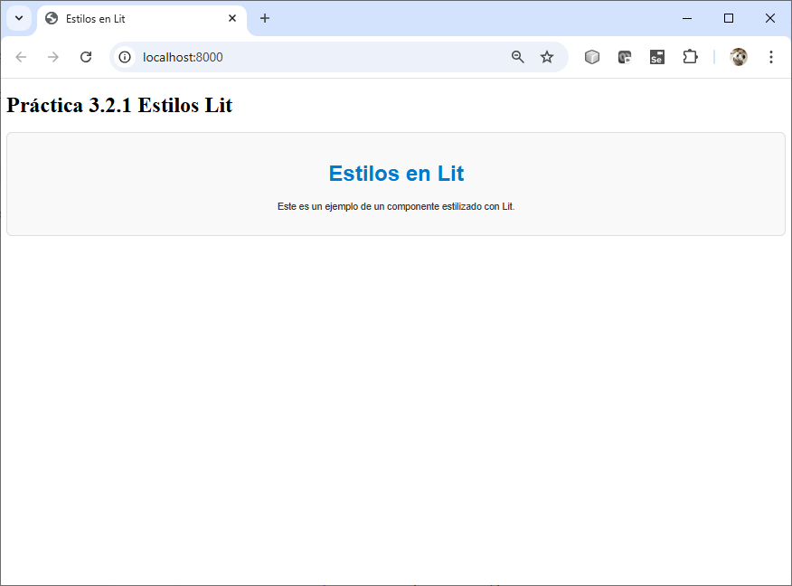
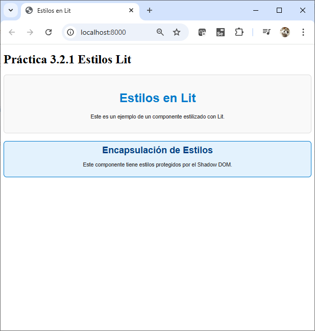
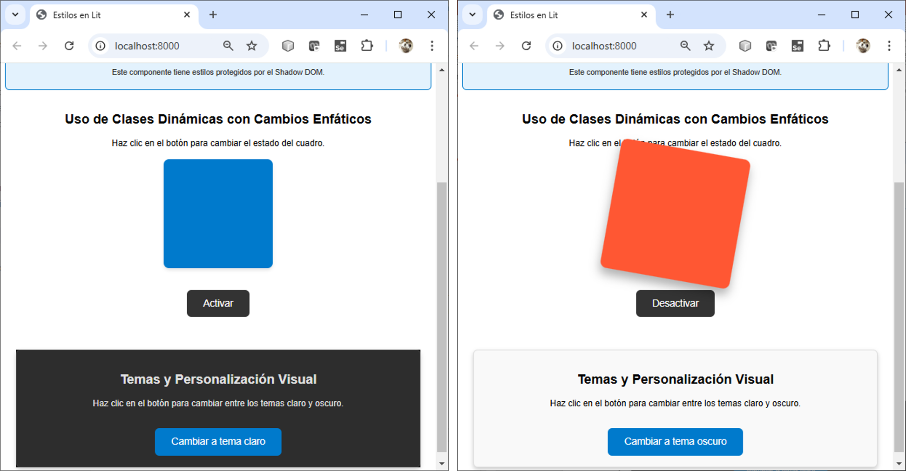

# Práctica 3.2.1 Estilos en Lit

## Objetivo de la práctica:
Al finalizar la práctica, serás capaz de:
- Definir estilos CSS dentro de un componente Lit.
- Aplicar estilos CSS a componentes Lit utilizando clases dinámicas para modificar la apariencia de los elementos en tiempo de ejecución.
- Implementar estilos CSS en un componente Lit y utilizar clases dinámicas para modificar la apariencia de los elementos en respuesta ae ventos o estados internos.
- Implementar un componente Lit con soporte para temas visuales, y personalización mediante propiedades y variables CSS.

 
## Duración aproximada:
- 125 minutos.


## Instrucciones 

### Tarea 1. Estilos en Lit

#### Paso 1. **Crear la carpeta principal del proyecto:**
   Ejecuta el siguiente comando para crear una carpeta llamada `practica3_2_1` que contendrá tu proyecto.  
   ```cmd
   mkdir practica3_2_1
   ```

#### Paso 2. **Inicializar el proyecto con Node.js:**
   Navega a la carpeta recién creada y prepara el entorno de trabajo inicializando un proyecto con Node.js.  
   ```cmd
   cd practica3_2_1
   npm init -y
   npm install lit
   npm install --save-dev es-dev-server
   ```

#### Paso 3. **Crear la estructura de carpetas y archivos:**

   - Crea una subcarpeta llamada `src` para organizar los archivos fuente.  
    
     ```cmd
     mkdir src
     ```

   - Dentro de la carpeta raíz, crea un archivo llamado `index.html`, que será el punto de entrada de tu proyecto.  
    
     ```cmd
     touch index.html
     ```
   
   - Dentro de la carpeta `src`, crea un archivo llamado `bb-estilos.js`, donde escribirás los estilos de tu componente Lit.  
    
     ```cmd
     cd src
     touch bb-estilos.js
     ```  

- **Nota** Con estos pasos, tendrás listo el proyecto base para comenzar a trabajar con estilos en Lit.


#### Paso 4. **Agregar contenido al archivo `bb-estilos.js`:**  

- Este archivo define un componente Lit con estilos aplicados.

   ```javascript
   import { LitElement, html, css } from 'lit';

   class BbEstilos extends LitElement {
     // Definición de estilos
     static styles = css`
       :host {
         display: block;
         font-family: Arial, sans-serif;
         text-align: center;
         color: #333;
       }
       .container {
         padding: 20px;
         border: 1px solid #ddd;
         border-radius: 8px;
         background-color: #f9f9f9;
       }
       h1 {
         color: #007acc;
       }
       p {
         font-size: 14px;
       }
     `;

     // Renderizado del componente
     render() {
       return html`
         <div class="container">
           <h1>Estilos en Lit</h1>
           <p>Este es un ejemplo de un componente estilizado con Lit.</p>
         </div>
       `;
     }
   }

   customElements.define('bb-estilos', BbEstilos);
   ```

#### Paso 5. **Actualizar el archivo `index.html`:**  

- Este archivo carga el componente y muestra su contenido.

   ```html
   <!DOCTYPE html>
   <html lang="en">
   <head>
     <meta charset="UTF-8" />
     <meta name="viewport" content="width=device-width, initial-scale=1.0" />
     <title>Estilos en Lit</title>
   </head>
   <body>
     <h1>Bienvenido a la práctica de Lit</h1>
    
     <!-- Componente personalizado -->
     <bb-estilos></bb-estilos>

     <!-- Cargar el módulo de JavaScript -->
     <script type="module" src="./src/bb-estilos.js"></script>
   </body>
   </html>
   ```

#### Paso 6. **Iniciar un servidor local para visualizar el proyecto:**  

  
- Agrega la instrucción siguiente en el archivo `package.json`

    ```json
    "scripts": {
        "start": "es-dev-server --app-index index.html --node-resolve --open"
      },
    
    ```

- Inicia el servidor local para ejecutar el proyecto.

   ```cmd
   npm start
   ```

#### Paso 7. **Verificar el resultado:**  
- Abre tu navegador web y observa cómo el componente `bb-estilos` se carga con los estilos definidos. Asegúrate de que los estilos se apliquen correctamente y que el diseño sea coherente.

<br/><br/>

### Tarea 2. Encapsulación de estilos con Shadow DOM

En esta tarea, aprenderás a encapsular estilos utilizando el Shadow DOM con Lit, garantizando que los estilos definidos no afecten ni sean afectados por otros elementos externos.
 

#### Paso 1. **Definir el componente en `bb-encapsulacion.js`:**

   Este archivo define un componente Lit con estilos encapsulados en el Shadow DOM.

   ```javascript
   import { LitElement, html, css } from 'lit';

   class BbEncapsulacion extends LitElement {
     // Definición de estilos encapsulados
     static styles = css`
       :host {
         display: block;
         font-family: Arial, sans-serif;
         text-align: center;
         padding: 10px;
         border: 2px solid #007acc;
         border-radius: 8px;
         background-color: #e3f2fd;
       }
       h2 {
         color: #004085;
         margin: 0;
       }
       p {
         font-size: 14px;
         color: #333;
       }
     `;

     // Renderizado del componente
     render() {
       return html`
         <h2>Encapsulación de Estilos</h2>
         <p>Este componente tiene estilos protegidos por el Shadow DOM.</p>
       `;
     }
   }

   customElements.define('bb-encapsulacion', BbEncapsulacion);
   ```

#### Paso 2. **Actualizar el archivo `index.html`:**

   Este archivo carga y muestra el componente con los estilos encapsulados.

   ```html
   <!DOCTYPE html>
   <html lang="en">
   <head>
     <meta charset="UTF-8" />
     <meta name="viewport" content="width=device-width, initial-scale=1.0" />
     <title>Encapsulación de Estilos con Shadow DOM</title>
   </head>
   <body>
     <h1>Demostración de Shadow DOM</h1>
     <!-- Componente personalizado -->
     <bb-encapsulacion></bb-encapsulacion>

     <!-- Cargar el módulo de JavaScript -->
     <script type="module" src="./src/bb-encapsulacion.js"></script>
   </body>
   </html>
   ```

#### Paso 3. **Probar el Componente**

- Utiliza un servidor local  para visualizar la aplicación.

    ```cmd
    npm start
    ```
   
#### Paso 4. **Verifica el resultado:**   
   - Abre tu navegador web y carga el archivo `index.html`.
   - Observa cómo los estilos del componente `bb-encapsulacion` se aplican solo a su contenido y están protegidos por el Shadow DOM.


#### Paso 5. **Modificar los estilos CSS**

- Busca la definición de estilos en el componente (la propiedad static styles).
- Cambia las propiedades del borde para establecer un grosor de 2 píxeles, un estilo sólido y un color rojo.
 
<br/><br/>

### Tarea 3. Uso de CSS en componentes Lit (CSS y clases dinámicas)

En esta tarea, aprenderás a usar estilos en componentes Lit, incluyendo la manipulación de clases dinámicas para personalizar la apariencia de los elementos en tiempo de ejecución.

#### Paso 1. **Definir el componente en `bb-clases-dinamicas.js`:**

Este archivo define un componente Lit que utiliza clases dinámicas para aplicar estilos según el estado interno del componente.

   ```javascript
  import { LitElement, html, css } from 'lit';

class BbClasesDinamicas extends LitElement {
  // Definición de estilos
  static styles = css`
    :host {
      display: block;
      font-family: Arial, sans-serif;
      text-align: center;
      margin: 20px;
    }
    .box {
      width: 200px;
      height: 200px;
      margin: 20px auto;
      background-color: #007acc;
      border-radius: 10px;
      transition: transform 0.3s ease, background-color 0.3s ease, box-shadow 0.3s ease;
      box-shadow: 0px 4px 6px rgba(0, 0, 0, 0.1);
    }
    .active {
      background-color: #ff5733;
      transform: scale(1.2) rotate(10deg);
      box-shadow: 0px 10px 15px rgba(0, 0, 0, 0.3);
    }
    .button {
      padding: 15px 30px;
      font-size: 18px;
      color: white;
      background-color: #333;
      border: none;
      border-radius: 8px;
      cursor: pointer;
      margin-top: 20px;
      transition: background-color 0.3s ease, transform 0.2s ease;
    }
    .button:hover {
      background-color: #555;
      transform: scale(1.05);
    }
  `;

  // Propiedades del componente
  static properties = {
    isActive: { type: Boolean },
  };

  constructor() {
    super();
    this.isActive = false; // Estado inicial
  }

  // Alternar el estado activo
  toggleActive() {
    this.isActive = !this.isActive;
  }

  // Renderizado del componente
  render() {
    return html`
      <h2>Uso de Clases Dinámicas con Cambios Enfáticos</h2>
      <p>Haz clic en el botón para cambiar el estado del cuadro.</p>
      <div class="box ${this.isActive ? 'active' : ''}"></div>
      <button class="button" @click="${this.toggleActive}">
        ${this.isActive ? 'Desactivar' : 'Activar'}
      </button>
    `;
  }
}

customElements.define('bb-clases-dinamicas', BbClasesDinamicas);
   ```

#### Paso 2. **Actualizar el archivo `index.html`:**

   Este archivo carga y muestra el componente con el uso de clases dinámicas.

   ```html
     <!-- Componente personalizado -->
     <bb-clases-dinamicas></bb-clases-dinamicas>
     <!-- Cargar el módulo de JavaScript -->
     <script type="module" src="./src/bb-clases-dinamicas.js"></script>
   ```

#### Paso 3. **Probar el Componente**

1. **Inicia un servidor local para ejecutar el proyecto:**  
  

   ```cmd
   npm start
   ```

2. **Verifica el resultado:**  
   - Abre el navegador y carga el archivo `index.html`.
   - Observa el botón en el componente `bb-clases-dinamicas`.
   - Haz clic en el botón para alternar su estado y ver cómo cambian los estilos dinámicamente.

<br/><br/>

### Tarea 4. Temas y personalización visual

En esta tarea, crearás un componente Lit que admita diferentes temas visuales (por ejemplo, claro y oscuro) y permita personalización adicional mediante propiedades.


#### Paso 1. **Definir el archivo `bb-temas.js`:**

   Este archivo define un componente Lit que permite cambiar entre temas visuales y personalizar colores.

   ```javascript
   import { LitElement, html, css } from 'lit';

   class BbTemas extends LitElement {
     // Definición de estilos y temas
     static styles = css`
       :host {
         display: block;
         font-family: Arial, sans-serif;
         text-align: center;
         margin: 20px;
         transition: background-color 0.3s ease, color 0.3s ease;
       }
       :host([theme="light"]) {
         background-color: #f9f9f9;
         color: #333;
       }
       :host([theme="dark"]) {
         background-color: #333;
         color: #f9f9f9;
       }
       .container {
         padding: 20px;
         border-radius: 8px;
         box-shadow: 0 4px 8px rgba(0, 0, 0, 0.2);
       }
       .button {
         padding: 10px 20px;
         font-size: 16px;
         color: white;
         background-color: #007acc;
         border: none;
         border-radius: 5px;
         cursor: pointer;
         margin-top: 20px;
         transition: background-color 0.3s ease;
       }
       .button:hover {
         background-color: #005fa3;
       }
       .custom {
         color: var(--custom-text-color, inherit);
         background-color: var(--custom-bg-color, transparent);
       }
     `;

     // Propiedades del componente
     static properties = {
       theme: { type: String, reflect: true },
     };

     constructor() {
       super();
       this.theme = 'light'; // Tema predeterminado
     }

     // Alternar el tema visual
     toggleTheme() {
       this.theme = this.theme === 'light' ? 'dark' : 'light';
     }

     // Renderizado del componente
     render() {
       return html`
         <div class="container custom">
           <h2>Temas y Personalización Visual</h2>
           <p>Haz clic en el botón para cambiar entre los temas claro y oscuro.</p>
           <button class="button" @click="${this.toggleTheme}">
             Cambiar a tema ${this.theme === 'light' ? 'oscuro' : 'claro'}
           </button>
         </div>
       `;
     }
   }

   customElements.define('bb-temas', BbTemas);
   ```

#### Paso 2. **Actualizar el archivo `index.html`:**

   Este archivo muestra el componente y permite personalizar los estilos.

   ```html
   <!DOCTYPE html>
   <html lang="en">
   <head>
     <meta charset="UTF-8" />
     <meta name="viewport" content="width=device-width, initial-scale=1.0" />
     <title>Temas y Personalización Visual</title>
     <style>
       /* Personalización adicional usando variables CSS */
       bb-temas {
         --custom-bg-color: #ffefc1;
         --custom-text-color: #5a3e00;
       }
     </style>
   </head>
   <body>
     <h1>Demostración de Temas y Personalización</h1>
     <!-- Componente personalizado -->
     <bb-temas theme="light"></bb-temas>

     <!-- Cargar el módulo de JavaScript -->
     <script type="module" src="./src/bb-temas.js"></script>
   </body>
   </html>
   ```

#### Paso 3. **Probar el Componente**

    - Usa un servidor local como `live-server` para cargar la aplicación.

   ```cmd
   npm start
   ```

#### Paso 4. **Verifica el resultado:**
   - Observa cómo el componente cambia entre los temas claro y oscuro al hacer clic en el botón.
   - Observa los colores personalizados aplicados mediante variables CSS.


### **Conclusión**

Con este componente, aprendiste a manejar temas y personalización visual en Lit, permitiendo alternar entre diferentes configuraciones de estilos y aplicar personalización adicional mediante propiedades y variables CSS. Esto mejora la flexibilidad y apariencia de los componentes en aplicaciones web modernas.

<br/><br/>

### Tarea 5 Uso de classMap

#### Paso 1. **Define un nuevo componente Lit**

```javascript

import { LitElement, html, css } from 'lit';
import { classMap } from 'lit-html/directives/class-map.js';

class BBClassMap extends LitElement {
  static styles = css`
    :host {
      display: flex;
      flex-direction: column;
      align-items: center;
      font-family: Arial, sans-serif;
      margin: 20px;
    }

    .active {
      color: white;
      background-color: green;
      padding: 10px;
      border-radius: 5px;
      transition: background-color 0.3s ease;
    }

    .disabled {
      color: white;
      background-color: gray;
      padding: 10px;
      border-radius: 5px;
      opacity: 0.7;
      transition: opacity 0.3s ease, background-color 0.3s ease;
    }

    .active.disabled {
      background-color: darkred;
    }

    div {
      font-size: 1.5rem;
      margin-bottom: 20px;
      padding: 10px;
      border: 2px solid transparent;
      transition: border-color 0.3s ease, transform 0.3s ease;
    }

    div:hover {
      border-color: black;
      transform: scale(1.05);
    }

    button {
      margin: 5px;
      padding: 10px 20px;
      font-size: 1rem;
      border: none;
      border-radius: 5px;
      cursor: pointer;
      transition: background-color 0.3s ease, transform 0.2s ease;
    }

    button:hover {
      background-color: lightgray;
      transform: scale(1.1);
    }

    button:active {
      transform: scale(0.95);
    }
  `;

  static properties = {
    isActive: { type: Boolean },
    isDisabled: { type: Boolean },
  };

  constructor() {
    super();
    this.isActive = false;
    this.isDisabled = false;
  }

  render() {
    const classes = {
      active: this.isActive,
      disabled: this.isDisabled,
    };

    return html`
      <div class="${classMap(classes)}">Hello, Lit!</div>
      <button @click="${() => (this.isActive = !this.isActive)}">
        Toggle Active
      </button>
      <button @click="${() => (this.isDisabled = !this.isDisabled)}">
        Toggle Disabled
      </button>
    `;
  }
}

customElements.define('bb-classmap', BBClassMap);

```

#### Paso 2. **Actualiza tu página HTML**

```html
 <!-- Componente personalizado -->
    <bb-classMap></bb-classMap>

    <!-- Cargar el módulo de JavaScript -->
    <script type="module" src="./src/bb-classmap.js"></script>
```

### Paso 3. **Verifica el resultado:**
Observa cómo el componente cambia dinámicamente al interactuar con los botones. Puedes alternar el estado utilizando el botón "Toggle Active" y/o combinarlos con el botón "Toggle Disabled".

1. ¿Cuántas combinaciones diferentes de estados lograste encontrar?
2. Observa cómo los colores personalizados cambian según el estado, aplicados dinámicamente mediante clases CSS y la directiva `classMap`. ¿Qué combinación te pareció más interesante?

<br/></br>


### Tarea 6 Transformación de Componente Lit

#### Paso 1. **Define un nuevo componente Lit y transforma el componente**

- Dado el siguiente código JavaScript que define un nuevo componente Lit, completa la implementación del segundo componente asegurando que utilice la directiva `classMap` para gestionar dinámicamente las clases CSS, manteniendo la misma funcionalidad que en el primer componente.

```javascript
import { LitElement, html, css } from 'lit';
 
class BBTextoNegritas extends LitElement {

    static get properties() {
        return {
            boldText: { type: Boolean }
        };
    }

    static get styles() {
        return css`
            p {
                font-size: 26px;
            }
            .bold {
                font-weight: bold;
            }
    ` ;
    }

    constructor() {
        super();
        this.boldText = false;
    }

    render() {
        return html`
            <p class="${this.boldText ? 'bold' : ''}">Este es un texto de ejemplo.</p>
            <button @click="${this.toggleBold}">Estilo</button>
    ` ;
    }

    toggleBold() {
        this.boldText = !this.boldText;
    }
}


class BBTextoNegritasD extends LitElement {
  
}

customElements.define('bb-texto-negritas', BBTextoNegritas);
customElements.define('bb-texto-negritasd', BBTextoNegritasD);

```

#### Paso 2. **Actualiza tu página HTML**

```html
    
    <H2>Opción Dada</H2>
    <script type="module" src="src/bb-texto-negritas.js"></script>
    <bb-texto-negritas></bb-texto-negritas>

    <H2>Opción Transformada</H2>
    <bb-texto-negritasd></bb-texto-negritasd>

```

### Paso 3. **Verifica el resultado:**
 
- Como último paso, verifica el comportamiento del componente recargando la página para asegurarte de que la funcionalidad y la gestión dinámica de clases con `classMap` se mantienen correctamente en esta práctica.

- ¿Qué sucedería si reemplazas el método `toggleBold()` en los componentes por el siguiente código? 

```javascript
toggleBold() {
    this.boldText = this.boldText;
}
```

<br/><br/>

## Resultados Esperados

- Captura de pantalla de la Tarea 1. Estilos en Lit



<br/>

- Captura de pantalla de la Tarea 2. Encapsulación de estilos con Shadow DOM




<br/>

- Captura de pantalla de la Tarea 3. Uso de CSS en componentes Lit (css y clases dinámicas)


<br/>

- Captura de pantalla de la Tarea 4. Temas



<br/>

- Captura de pantalla de la Tarea 5. Uso de classMap


