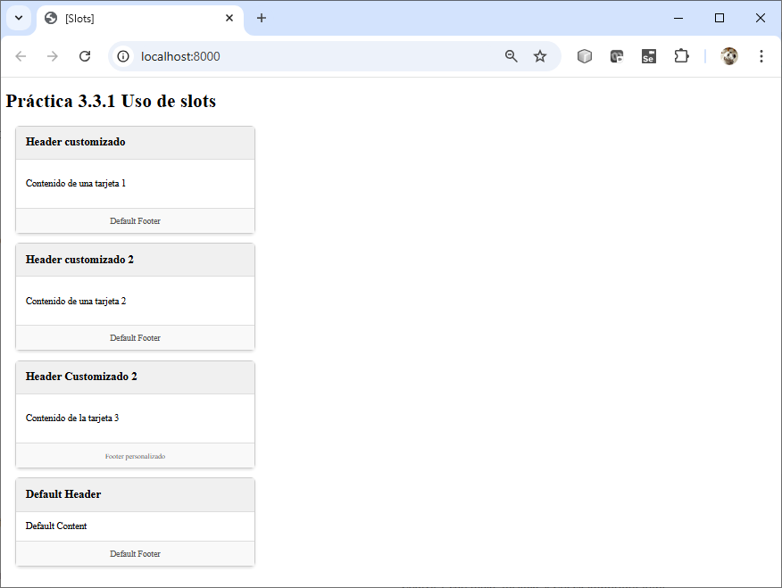

# Práctica 3.3.1 Slots

## Objetivo de la práctica:
Al finalizar la práctica, serás capaz de:
- Implementar y utilizar slots en un componente de Lit para crear estructuras flexibles y reutilizables, permitiendo que los usuarios personalicen partes del contenido interno del componente.
  
## Duración aproximada:
- 95 minutos.

## Instrucciones 
 
### Tarea 1. Crear un componente con slots

1. Implementa un componente Lit que soporte al menos dos slots:
   - **Slot predeterminado**: Para mostrar contenido genérico.
   - **Slot con nombre**: Para personalizar una sección específica del componente.

2. Agrega estilos básicos para diferenciar visualmente cada slot.

#### Paso 1. **Crear la carpeta principal del proyecto:**

   Ejecuta el siguiente comando para crear una carpeta llamada `practica3_3_1` que contendrá tu proyecto.  
   ```cmd
   mkdir practica3_3_1
   ```

#### Paso 2. **Inicializar el proyecto con Node.js:**
   Navega a la carpeta recién creada y prepara el entorno de trabajo inicializando un proyecto con Node.js.  
   ```cmd
   cd practica3_3_1
   npm init -y
   npm install lit
   npm install --save-dev es-dev-server
   ```

#### Paso 3. **Crear la estructura de carpetas y archivos:**

   - Crea una subcarpeta llamada `src` para organizar los archivos fuente.  
    
     ```cmd
     mkdir src
     ```

   - Dentro de la carpeta raíz, crea un archivo llamado `index.html`, que será el punto de entrada de tu proyecto.  
    
     ```cmd
     touch index.html
     ```
   
   - Dentro de la carpeta `src`, crea un archivo llamado `bb-estilos.js`, donde escribirás los estilos de tu componente Lit.  
    
     ```cmd
     cd src
     touch bb-slots.js
     ```  


#### Paso 4. **Crear el componente `my-card`**
1. Define un nuevo componente llamado `my-card`.

2. Usa la clase `LitElement` y extiéndela.

3. En el método `render`, incluye un diseño básico con dos slots:
   - Un **slot predeterminado** para contenido general.
   - Un **slot nombrado** llamado `"header"` para contenido de encabezado.

```javascript

import { LitElement, html, css } from 'lit';

class BBCard extends LitElement {
  static styles = css`
    :host {
      display: block;
      border: 1px solid #ccc;
      border-radius: 8px;
      box-shadow: 0 2px 4px rgba(0, 0, 0, 0.1);
      max-width: 400px;
      margin: 16px;
    }
    .header {
      background-color: #f0f0f0;
      padding: 16px;
      font-weight: bold;
      font-size: 1.2em;
      border-bottom: 1px solid #ddd;
    }
    .content {
      padding: 16px;
    }
  
  `;

  render() {
    return html`
      <div class="header">
        <slot name="header">Default Header</slot>
      </div>
      <div class="content">
        <slot>Default Content</slot>
      </div>
    `;
  }

}

customElements.define('bb-card', BBCard);
```

#### Paso 5. **Usar el componente `my-card`**
1. En el archivo HTML de tu proyecto, utiliza el componente `my-card`.

2. Agrega contenido personalizado al **slot nombrado** y al **slot predeterminado**.

```html
<my-card>
  <div slot="header">Custom Header Content</div>
  <p>This is the main content inside the card. You can customize this section as needed.</p>
</my-card>
```

#### Paso 6. **Agregar otro uso del componente**
1. Crea un segundo `my-card` con diferentes contenidos en los slots para observar la flexibilidad.

2. Personaliza los estilos del contenido utilizando clases o estilos en línea.

```html
<!DOCTYPE html>
<html lang="en">

<head>
    <meta charset="UTF-8">
    <meta name="viewport" content="width=device-width, initial-scale=1.0">
    <title>[Slots]</title>
    <script type="module" src="./src/bb-slots.js"></script>
</head>

<body>
    <h1>Práctica 3.3.1 Uso de slots</h1>
    <bb-card>
        <div slot="header">Header customizado </div>
        <p>Contenido de una tarjeta 1</p>
    </bb-card>
   
    <bb-card>
        <div slot="header">Header customizado 2 </div>
        <p>Contenido de una tarjeta 2</p>
    </bb-card>
</body>
</html>
```


#### Paso 7. **Iniciar un servidor local para visualizar el proyecto:**  
  
- Agrega la instrucción siguiente en el archivo `package.json`

    ```json
    "scripts": {
        "start": "es-dev-server --app-index index.html --node-resolve --open"
      },
    
    ```

- Inicia el servidor local para ejecutar el proyecto.

   ```cmd
   npm start
   ```

#### Paso 8. **Verificar el resultado:**  
- Abre tu navegador web y observa cómo el componente `bb-slots` se comporta de acuerdo a la codificación.  

<br/><br/>


### Tarea adicional:

#### Paso 1. **Agrega un tercer slot opcional llamado `"footer"` para el pie del componente.**

Muestra un mensaje predeterminado si el slot `"footer"` no recibe contenido.

```javascript
render() {
    return html`
      <div class="header">
        <slot name="header">Default Header</slot>
      </div>
      <div class="content">
        <slot>Default Content</slot>
      </div>
      <div class="footer">
        <slot name="footer">Default Footer</slot>
      </div>
    `;
  }
```

#### Paso 2. **Ejemplo de uso:**

```html
    <bb-card>
        <div slot="header">Header Customizado 2</div>
        <p>Contenido de la tarjeta 3</p>
        <small slot="footer">Footer personalizado</small>
    </bb-card>

    <bb-card></bb-card>
```

#### Paso 3. **Mejora su estilo**

```javascript
  .footer {
      background-color: #f9f9f9;
      padding: 12px 16px;
      font-size: 0.9em;
      color: #555;
      border-top: 1px solid #ddd;
      text-align: center;
    }
```

<br/><br/>

### Resultado esperado
 
- Captura de pantalla con la salida de la práctica.




